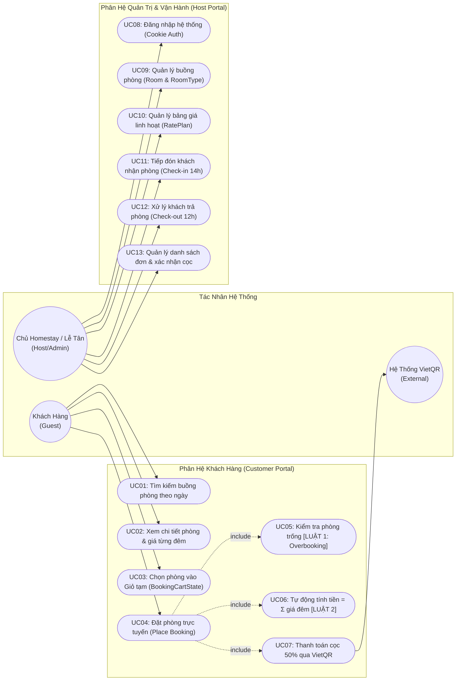
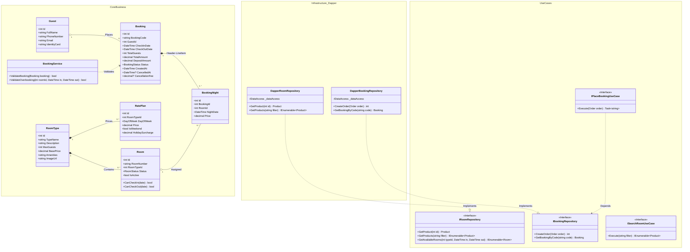
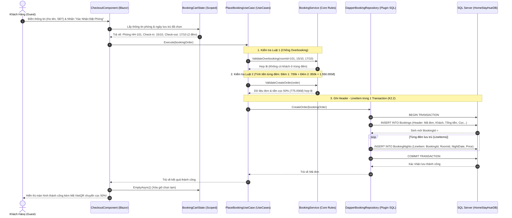
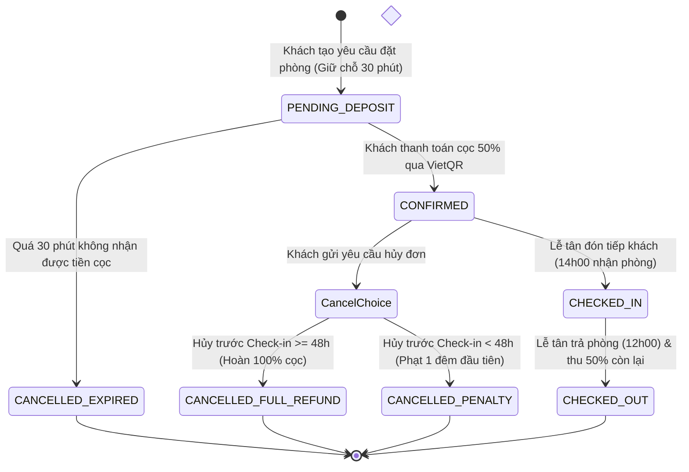
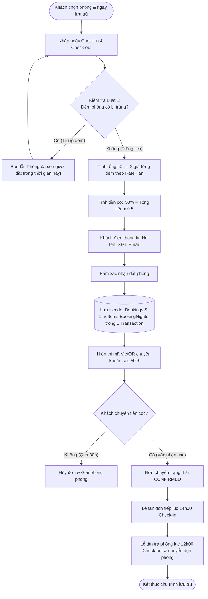
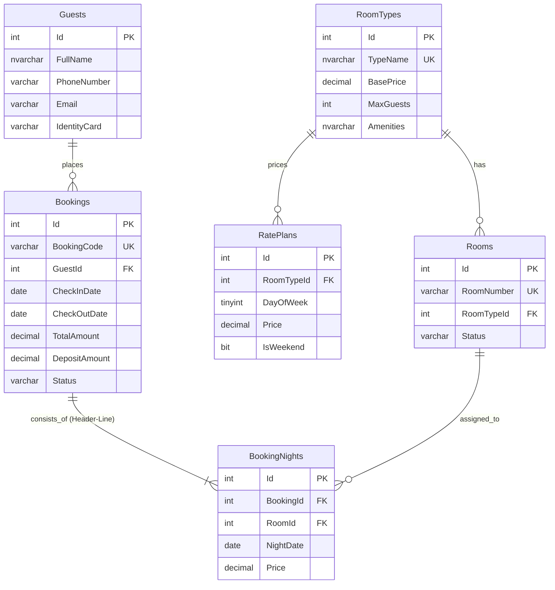

# 🌿 HỆ THỐNG ĐẶT PHÒNG TRỰC TUYẾN HOMESTAY HUẾ

---

## 🎓 THÔNG TIN HỌC VIÊN & ĐỀ TÀI

* **Họ và tên sinh viên:** **Trần Viết Mạnh Cường**
* **Mã sinh viên (MSV):** **23K4080003**
* **Ngành đào tạo:** **Tin học kinh tế**
* **Khoa:** **Hệ thống thông tin kinh tế**
* **Học phần:** **Lập trình ứng dụng Web**
* **Tên đề tài:** **Nền tảng đặt phòng trực tuyến Homestay Huế (Hệ thống Quản lý & Đặt phòng Homestay Cố Đô Huế)**
* **Repository GitHub:** [https://github.com/ManhCuong-Code/HomeStayHue](https://github.com/ManhCuong-Code/HomeStayHue)

---

## 📖 1. TỔNG QUAN ĐỀ TÀI

### 1.1. Bối cảnh & Vấn đề thực tế
Cố Đô Huế là điểm đến du lịch văn hóa, di sản hàng đầu với mô hình lưu trú homestay ngày càng phát triển mạnh mẽ. Hiện nay, đa số các chủ cơ sở homestay tại Huế đều phụ thuộc hoàn toàn vào các sàn đại lý du lịch trực tuyến (OTA) như Booking.com hay Agoda, dẫn tới nhiều bất cập:
* **Chi phí hoa hồng cao:** Bị cắt phế từ **15% đến 25%** tổng doanh thu mỗi tháng.
* **Giam giữ dòng tiền:** Tiền phòng bị sàn trung gian giữ từ 15 đến 30 ngày mới giải ngân.
* **Mất dữ liệu khách hàng:** Không có thông tin liên hệ trực tiếp để tư vấn và chăm sóc khách quen.

### 1.2. Mục tiêu dự án
Xây dựng một nền tảng Web đặt phòng trực tuyến độc lập giúp các cơ sở Homestay Huế:
1. **Tự chủ kinh doanh:** Giữ trọn 100% doanh thu, tiền cọc 50% thanh toán trực tiếp qua mã **VietQR** vào tài khoản ngân hàng.
2. **Kiểm soát buồng phòng tuyệt đối:** Loại bỏ 100% rủi ro trùng phòng (Overbooking) nhờ thuật toán quản lý theo từng đêm lưu trú (`NightDate`).
3. **Chính sách giá & hủy cọc linh hoạt:** Áp dụng giá theo ngày trong tuần (Dynamic Pricing) và luật hủy phòng trước 48 giờ minh bạch.

---

## 🛠️ 2. KIẾN TRÚC & CÔNG NGHỆ ÁP DỤNG

Hệ thống được thiết kế theo chuẩn **Clean Architecture 4 tầng** (Onion Architecture), tách biệt hoàn toàn giữa Core Nghiệp Vụ, Use Cases, Hạ tầng CSDL và Giao diện người dùng:

| Tầng Kiến Trúc | Dự án trong Solution | Công Nghệ & Vai Trò |
|---|---|---|
| **1. Core Business** | `HomeStayHue.CoreBusiness` | Domain Entities (`Room`, `Booking`, `Guest`, `RatePlan`...) & Business Rules (Độc lập, 0 tham chiếu). |
| **2. Use Cases** | `HomeStayHue.UseCases` | Chứa Application Services & Plugin Interfaces (`IRoomRepository`, `IBookingRepository`...). |
| **3. Infrastructure / Plugins** | `Plugins/HomeStayHue.DataStore.SQL.Dapper`<br>`Plugins/HomeStayHue.ShoppingCart.LocalStorage`<br>`Plugins/HomeStayHue.StateStore.DI` | Cài đặt truy xuất CSDL SQL Server với **Dapper ORM**, lưu giao dịch Header-Line trong 1 Transaction, quản lý State giỏ hàng. |
| **4. Presentation / Web Host** | `HomeStayHue.Web`<br>`HomeStayHue.Web.CustomerPortal`<br>`HomeStayHue.Web.AdminPortal`<br>`HomeStayHue.Web.Common` | Giao diện **Blazor Web App (.NET 10 LTS)** với tương tác Server Interactive SPA, Cookie Authentication & Authorization. |

---

## 📊 3. MÔ HÌNH HÓA HỆ THỐNG BẰNG UML (UNIFIED MODELING LANGUAGE)

### 3.1. Sơ Đồ Ca Sử Dụng Tổng Thể (Use Case Diagram)



---

### 3.2. Sơ Đồ Lớp 4 Tầng (Class Diagram - Clean Architecture)



---

### 3.3. Sơ Đồ Tuần Tự Luồng Giao Dịch Chính (Sequence Diagram - End to End Booking)

Minh họa quy trình đặt phòng, kiểm tra 2 luật nghiệp vụ và lưu giao dịch Header - LineItem trong **cùng 1 Transaction**:



---

### 3.4. Sơ Đồ Chuyển Trạng Thái Đơn Đặt & Buồng Phòng (State Machine Diagram)



---

### 3.5. Sơ Đồ Hoạt Động (Activity Diagram)



---

## ⚖️ 4. HAI LUẬT NGHIỆP VỤ CỐT LÕI

* **Luật Nghiệp Vụ 1 (Chống Overbooking):**
  * Quản lý trạng thái lưu trú theo từng đêm (`NightDate` từ 14h00 ngày $D$ đến 12h00 ngày $D+1$).
  * Quy tắc: Khách cũ trả phòng ngày $D$ (12h00) và khách mới nhận phòng ngày $D$ (14h00) là **hoàn toàn hợp lệ**, không xung đột lịch.
* **Luật Nghiệp Vụ 2 (Dynamic Pricing & Chính Sách Phạt Hủy 48H):**
  * Tổng tiền thuê phòng tự động tính:
    $$\text{TotalAmount} = \sum_{i=1}^{N} \text{Giá đêm}_i$$
    *(Giá ngày thường Thứ 2 - Thứ 5 thấp hơn giá cuối tuần Thứ 6 - Chủ Nhật theo `RatePlans`)*.
  * Tiền cọc yêu cầu: $\text{DepositAmount} = 50\% \times \text{TotalAmount}$.
  * Chính sách hủy cọc:
    * Hủy trước $\ge 48$ tiếng trước giờ Check-in: Hoàn 100% tiền cọc.
    * Hủy gấp $< 48$ tiếng trước giờ Check-in: Khấu trừ phí phạt tương đương **giá của 1 đêm đầu tiên** (`CancellationFee`) để bù lỗ phòng trống.

---

## 🔐 5. CẤU TRÚC XÁC THỰC & PHÂN QUYỀN (AUTHENTICATION & AUTHORIZATION)

Hệ thống được thiết kế theo mô hình phân quyền chặt chẽ đáp ứng tiêu chí **K4.1 & K4.2** trong barem đánh giá:

| Đối Tượng Người Dùng | Yêu Cầu Đăng Nhập | Quyền Hạn & Chức Năng Trên Hệ Thống |
|---|---|---|
| **Khách Hàng Vãng Lai (Guest)** | ❌ **Không cần đăng nhập** | Tự do tìm kiếm buồng phòng, xem chi tiết phòng, chọn phòng vào giỏ và hoàn tất đặt cọc trực tuyến chỉ với việc nhập thông tin liên lạc (Họ tên, SĐT, Email). |
| **Khách Hàng Thành Viên (Customer)** | 💡 **Tùy chọn đăng nhập** | Đăng nhập tài khoản (`khachhang` / `123456`) để tự động điền sẵn thông tin khi đặt phòng và lưu vết lịch sử giao dịch cá nhân. |
| **Nhân Viên Tiếp Tân (Staff / Receptionist)** | 🔒 **BẮT BUỘC đăng nhập** | Truy cập phân hệ `/admin` (`[Authorize(Roles = "Staff,Admin")]`) để **kiểm tra danh sách đơn đặt phòng**, duyệt cọc, kiểm tra bảng trạng thái buồng phòng (Sẵn sàng / Đang có khách / Dọn phòng). |
| **Quản Trị Viên (Admin / Host)** | 🔒 **BẮT BUỘC đăng nhập** | Toàn quyền kiểm tra, cấu hình bảng giá `RatePlans`, duyệt đơn và quản lý toàn bộ hệ thống. |

### Danh Sách Tài Khoản Thử Nghiệm Hệ Thống (Mật khẩu chung: `123456`)
* 🛡️ **Nhân viên / Lễ tân:** Username: `letan` | Role: `Staff` *(Dành riêng cho nhân viên đăng nhập để kiểm tra hệ thống)*
* 👑 **Quản trị viên:** Username: `admin` | Role: `Admin` *(Toàn quyền quản trị)*
* 👤 **Khách hàng thân thiết:** Username: `khachhang` | Role: `Customer` *(Tài khoản khách hàng tùy chọn)*

---

## 🗄️ 6. CƠ SỞ DỮ LIỆU SQL SERVER (CHUẨN 3NF)

Kịch bản CSDL lưu tại: [database/schema.sql](database/schema.sql)



---

## 🚀 7. HƯỚNG DẪN KHỞI CHẠY DỰ ÁN

### Yêu Cầu Môi Trường
* **.NET SDK:** 10.0 trở lên
* **Hệ Quản trị CSDL:** Microsoft SQL Server 2019/2022 hoặc SQL Server Express (`.\SQLEXPRESS`)

### Bước 1: Khởi tạo Cơ sở Dữ liệu
Chạy tệp SQL kịch bản trực tiếp bằng `sqlcmd` hoặc mở bằng SQL Server Management Studio (SSMS):
```powershell
sqlcmd -S ".\SQLEXPRESS" -E -C -i "database/schema.sql"
```

### Bước 2: Cấu hình Chuỗi Kết Nối
Kiểm tra cấu hình trong `project/HomeStayHue/HomeStayHue.Web/appsettings.json`:
```json
"ConnectionStrings": {
  "DefaultConnection": "Server=.\\SQLEXPRESS;Database=HomeStayHueDB;Trusted_Connection=True;TrustServerCertificate=True;"
}
```

### Bước 3: Biên dịch & Chạy Website
```powershell
# Chuyển vào thư mục solution
cd project/HomeStayHue

# Biên dịch toàn bộ 10 dự án thành phần
dotnet build HomeStayHue.slnx

# Khởi chạy Website Blazor
dotnet run --project HomeStayHue.Web/HomeStayHue.Web.csproj
```
Truy cập trình duyệt tại địa chỉ: `https://localhost:7082` (hoặc cổng hiển thị trên console).